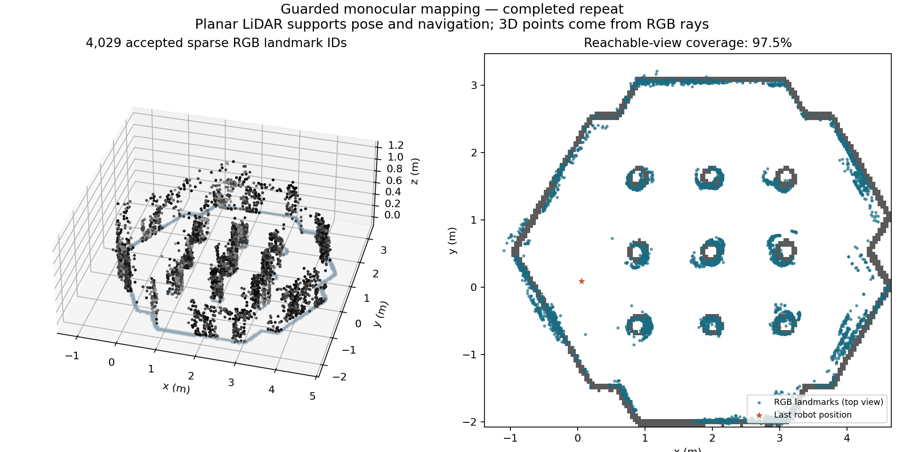

# TurtleBot3 monocular sensor fusion

Experimental sparse 3D mapping with a simulated TurtleBot3 Waffle with CPU-based estimation on a desktop with integrated graphics for rendering. Three-dimensional landmarks come from monocular RGB triangulation. Wheel odometry, raw IMU measurements and planar LiDAR SLAM support camera pose and autonomous exploration.

**Status:** experimental research software, with three archived development stages. The latest archived completed mission is from 2 October 2026. Surface completeness, absolute accuracy and global consistency are not established. The repository migration itself did not constitute a new robot run. A separate, bounded replication campaign began on the Dell on 7 October 2026 at 19:31 UTC; its results remain pending review. See the [prospective protocol](docs/PROTOCOL-2026-10-07.md) and [campaign runner](tools/campaign_runner.py). The runner schedules up to three sequential trials, records resource usage and stops after a failed trial. It does not establish publication readiness.



The ground-plane outline is a planar LiDAR occupancy reference. Only the sparse RGB landmarks encode reconstructed height.

## Start here

- [English experimental report](paper/guarded-repeat-report.md)
- [Automatically extracted metrics](results/summary.md)
- [Sensor roles and limitations](docs/method.md)
- [Reproduction and dependency notes](docs/reproduction.md)
- [Data inventory and provenance](data/README.md)
- [Article material index](paper/README.md)

## Latest results

The guarded mission covered 156/160 planned reachable views (97.5%), returned home and stopped. It accepted 4,029 sparse landmark IDs and scored 8,920 reserved pixel observations: median 0.240 px, p90 0.748 px, maximum 7.689 px. These errors use 960 × 540 working images. View coverage is not surface coverage; landmark IDs can duplicate physical features.

Revisit evidence remains limited: the 52 pairs passing the epipolar check cover only one pair of reconstruction blocks. The runs have different adaptive trajectories, starts and time budgets, so their comparison is descriptive, not a causal ablation.

## Repository layout

The `experiments/` entries below are restored locally from the ZIP archives; the other directories are directly browsable on GitHub.

| Directory | Contents |
| --- | --- |
| `runtime/` | Byte-identical guarded-run Python code and ROS/RViz configuration, without recorded output |
| `experiments/2026-09-30-texture-pilot/` | Uniform/textured pilot, scene authoring, upstream asset copies, reports and selected evidence |
| `experiments/2026-10-01-baseline/` | Original autonomous mission, preserved timeout/resume history and revisit audit |
| `experiments/2026-10-02-guarded/` | Prospective guarded-tracker repeat, maps, metrics and verification |
| `tools/` | Offline integrity verification, summary extraction and preparation of fresh run directories |
| `paper/` | English report, figure and manuscript evidence index |
| `results/` | Small machine-readable and Markdown result tables |
| `data/` | Checksums and inventory of omitted large raw recordings |
| `environments/` | Observed software versions and analysis dependency list |

The original experiment trees are distributed as checksum-verified ZIP archives at the repository root. Run `python3 tools/restore_experiments.py` to restore them under `experiments/`. Archived experiment files are preserved byte for byte. Original absolute paths, process IDs and historical status text are provenance, not instructions to act on current processes. Future code changes belong in `runtime/`; new experiments receive new directories.

## Offline inspection

These commands require Python 3 only and do not import ROS, contact the robot, or publish commands:

```bash
python3 tools/restore_experiments.py
python3 tools/verify_evidence.py
python3 tools/summarize_experiments.py --check
```

The maps can be opened directly from each experiment's `output/stable/monocular_stable.ply`. Full sensor replay requires raw inputs retained on the Dell; they are not in Git. See [reproduction notes](docs/reproduction.md) before launching any historical script.

## Research boundaries

No RGB-D/depth, compass/magnetometer, `Imu.orientation`, simulator ground-truth pose or world geometry is used by the estimator/controller. Scene geometry is used only for simulator authoring. No LiDAR extrusion, learned monocular depth or dense completion is performed. The stable fitter uses a flat-floor pose prior; this is not a full visual-inertial SLAM implementation with IMU preintegration.

Original code is licensed under **Apache 2.0**; original reports, figures and datasets under **CC BY 4.0**. Upstream assets retain their own licenses. See [licensing scope](LICENSING.md) and [third-party notices](THIRD_PARTY_NOTICES.md). Paper authorship and archival DOI remain pending. Record the Git commit together with an experiment ID when citing or comparing results.

## Preserved experiment archives and Git history

- [Texture pilot](tb3_texture_experiment.zip)
- [Autonomous baseline](tb3_autonomous_texture.zip)
- [Guarded repeat](tb3_guarded_trial.zip)
- [Original preparation Git history](repository-history.bundle)

The browser upload has its own Git commits. `repository-history.bundle` preserves the original local preparation commit `f6703ed59cc9618ab7282dfa4d14867d33138f4f` and `archive-2026-10-02` tag. Restore that history with `git clone repository-history.bundle historical-preparation`. This archive layout was adopted for the browser transfer; estimator code and numerical evidence are unchanged.
