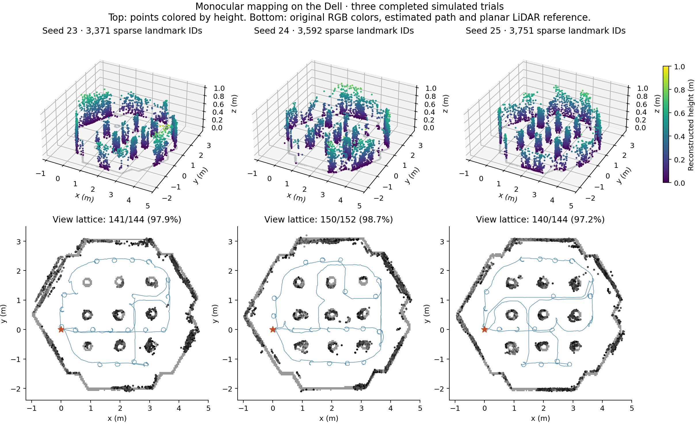
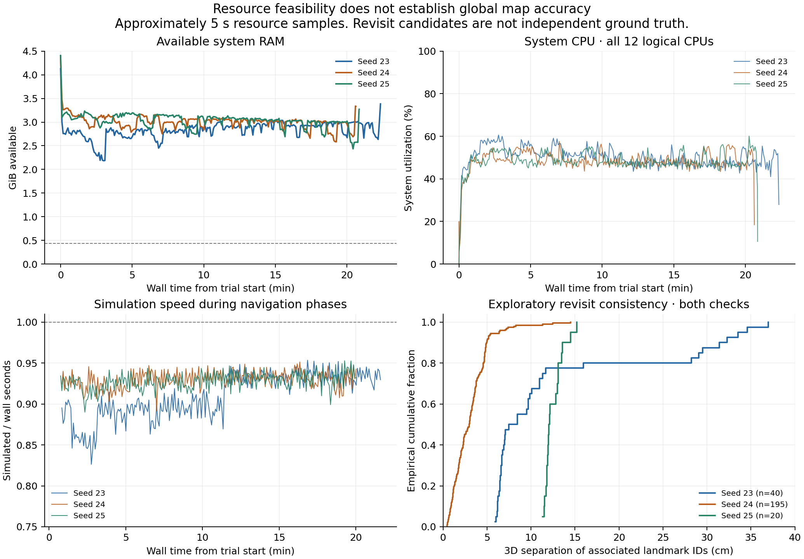

# Three-run replication on a resource-constrained desktop

Analysis date: 8 October 2026. Campaign: 7 October 2026, 19:31:26–20:35:17 UTC (16:31:26–17:35:17 in Maceió). This report closes the bounded replication phase; it is not a completed journal manuscript.

## Main finding

All three simulated TurtleBot3 Waffle trials completed the controller's reachable-view stopping criterion, returned near the estimated start and ended with observed zero linear and angular commands. Each produced 3,371–3,751 accepted sparse monocular landmark IDs. The Dell sustained the complete workload without a recorded memory, disk or wall-time stop. However, small reserved-pixel residuals coexisted with variable disagreement between visually associated landmarks from different revisits. The evidence supports technical feasibility and local reconstruction repeatability in this scene, while global geometric consistency remains unresolved.

## Protocol and sensor roles

The [prospective protocol](../docs/PROTOCOL-2026-10-07.md) was saved and hashed on the Dell before robot motion; its GitHub upload occurred after startup. This is not an externally preregistered study. Three trials used the same textured geometry, start pose, estimator thresholds and 2,400-second navigation budget, with Gazebo seeds 23, 24 and 25 in that fixed order. ROS domain 75 and the campaign transport partition isolated the trials. Trials ran sequentially; source hashes match their launch manifests. Historical outputs were preserved.

3D landmarks come from RGB ray triangulation. Wheel velocity and raw gyro support the planar pose filter; accelerometer measurements support attitude/stationarity handling; planar LiDAR SLAM supplies map-frame pose support. The stable fitter uses a flat-floor motion prior. It is not joint full visual-inertial SLAM with IMU preintegration, and these all-sensor repeats do not measure the causal contribution of the IMU or any other individual sensor. No depth/RGB-D, compass, IMU orientation, simulator pose or world geometry is supplied to the estimator/controller. The scene is loaded only by Gazebo. Sensor topics and source code are retained for audit.

Hardware: Dell Vostro 3710, Intel Core i5-12400 (6 physical cores, 12 logical CPUs), 8 GiB installed RAM (7.45 GiB reported usable), Intel UHD 730 integrated graphics. Ubuntu 24.04; observed kernel 7.0.0-34-generic. ROS 2 Jazzy, turtlebot3_gazebo 2.3.7, ros_gz_bridge 1.0.24, slam_toolbox 2.8.5, NumPy 1.26.4, SciPy 1.11.4. Estimation/reconstruction ran on the CPU, and Gazebo used integrated graphics for sensor rendering. Server-only Gazebo and one RViz were active per trial. This is not an exclusive-machine or GPU-memory benchmark; unrelated desktop processes remained possible.

## Navigation and termination

| Seed | Controller wall time (min) | Estimated travel (m) | Covered / planned views | Goals reached | Failed goals | Estimated home offset (m) |
| --- | --- | --- | --- | --- | --- | --- |
| 23 | 21.55 | 31.54 | 141/144 (97.92%) | 86 | 12 | 0.117 |
| 24 | 19.87 | 33.37 | 150/152 (98.68%) | 87 | 6 | 0.135 |
| 25 | 20.13 | 34.40 | 140/144 (97.22%) | 72 | 11 | 0.134 |

The controller terminates at at least 97% view-lattice coverage; it does not require 100% and does not certify surface completeness. The lattice is recomputed from the estimated occupancy map, so its denominator differs across runs. All three final states report `home_reached`, with no limited reverse recoveries. Distances and home offsets use estimated poses, not ground truth. The full sequential campaign, including startup and cleanup, lasted 63.85 wall minutes. The simulator pause was confirmed before cleanup, and the command audit ends at [0, 0] for every trial. No campaign simulation or controller remained running when inspected on 8 October.

## Sparse reconstruction and reserved pixel observations

| Seed | Landmark IDs | Fit keyframes | Test observations | Median (px) | p90 (px) | Max (px) | Over 3 px | Over 8 px | Unscored IDs |
| --- | --- | --- | --- | --- | --- | --- | --- | --- | --- |
| 23 | 3371 | 2027 | 7554 | 0.245 | 0.786 | 7.355 | 12 | 0 | 0 |
| 24 | 3592 | 1868 | 8333 | 0.228 | 0.693 | 5.266 | 12 | 0 | 1 |
| 25 | 3751 | 1956 | 7736 | 0.226 | 0.685 | 5.139 | 12 | 0 | 0 |

Pixels use the 960 × 540 processing resolution. Reported distributions were recomputed from saved per-landmark residuals; PLY coordinates, colors, counts, final fit frame counts and test/training frame disjointness passed their integrity checks. All fitted blocks in these final maps reported convergence. The seed-24 run includes one accepted ID without scored test observations, which remains in the table. Landmark IDs can duplicate physical features.

Reserved observations are drawn from existing tracks. Camera poses can be fitted using other tracks that share those frames, so the test is not an independent journey or a metric-accuracy benchmark. Thresholds were unchanged during this campaign. These three runs do not justify inferential claims about broad robustness, and the prior October 2 result is not a controlled causal baseline because routes, workload and timing differ.



Figure 1. Top panels use height colors solely for visualization; bottom panels use original saved RGB colors. Blue curves are estimated camera paths, and the star marks the estimated start. Gray occupancy references come from planar LiDAR; they do not contribute reconstructed height. Common axes facilitate visual comparison without additional registration. The synthetic scene has predominantly gray textures, so grayscale point colors are expected. Sparse points and view coverage do not establish a complete 3D surface.

## Cross-revisit consistency: the unresolved limitation

An unchanged historical audit selects nearby estimated camera views separated by at least 40 simulated seconds, matches SIFT descriptors at tracked RGB locations, applies mutual ratio matching and an epipolar check, and reports one vote per unordered landmark pair. The stricter subset also requires support in multiple separated image pairs. It applies no 3D registration or distance-based rejection to improve the reported residuals. The audit is exploratory: associations can still be wrong, selection uses estimated poses, the scene has repeated textures, and selected block pairs cover only part of the map.

| Seed | Epipolar pairs | Median (cm) | p90 (cm) | Both-check pairs | Block pairs (both) | Median both (cm) | p90 both (cm) | Max both (cm) |
| --- | --- | --- | --- | --- | --- | --- | --- | --- |
| 23 | 211 | 6.97 | 32.28 | 40 | 6 | 7.96 | 31.51 | 36.99 |
| 24 | 387 | 2.75 | 5.22 | 195 | 2 | 3.00 | 4.95 | 14.50 |
| 25 | 82 | 11.48 | 13.17 | 20 | 1 | 12.06 | 13.66 | 15.21 |

The stricter subset has p90 separation of about 31.5 cm for seed 23, 4.95 cm for seed 24 and 13.7 cm for seed 25. Seed 25's stricter evidence covers only one block pair; seed 24 covers two and seed 23 covers six. The low pixel residuals therefore do not guarantee cross-submap alignment. Approximate global graph placement and data association are plausible contributors, not experimentally isolated causes. These separations are consistency diagnostics, not absolute position errors or calibrated uncertainty. All candidate subsets, tails and block-pair identities are preserved.

## Hardware as an experimental condition

| Seed | Min available RAM (GiB) | Max sampled summed PSS (GiB) | Max system swap (MiB) | Median system CPU (%) | Median navigation RTF | Free-disk decrease (GiB) |
| --- | --- | --- | --- | --- | --- | --- |
| 23 | 2.18 | 1.83 | 376.2 | 50.7 | 0.913 | 4.80 |
| 24 | 2.58 | 1.75 | 376.4 | 48.5 | 0.929 | 4.31 |
| 25 | 2.43 | 1.77 | 376.4 | 48.1 | 0.928 | 4.61 |

PSS is proportional resident memory summed over discovered campaign descendants; it is not total system RAM use or separate GPU memory. RSS sums are retained but double-count shared pages. CPU percentages in this table cover the whole system on a 0–100 scale; the detailed per-process convention uses 100% per logical CPU. Values are sampled approximately every five seconds, so brief peaks may be missed. RTF is simulated time divided by wall time during intervals assigned to navigation phases using the command audit; it is not end-to-end image latency.

No trial crossed the campaign stop thresholds (450 MiB available RAM, 6 GiB free disk or 4,500 seconds per mission). No experiment in this bounded phase was ruled out or aborted by an observed hardware limit. Swap persisted across trials, and fixed execution order plus cache state confound seed-specific runtime comparisons. The three runs consumed about 13.72 GiB of free disk in total; about 15.7 GiB remained afterward. Storage is a practical constraint for further raw-data collection, but this observation is not an actually failed storage experiment. GPU utilization, power, thermal throttling, dense reconstruction and larger worlds were not benchmarked and must not be described as proven feasible or infeasible.



Figure 2. Resource traces and the empirical separation distribution for the stricter revisit subset. The RAM dashed line is the wrapper stop threshold. The RTF dashed line denotes real time. Revisit curves have different support and are not independent samples of global map error.

## Recording integrity and software issues

| Seed | Recorded messages | Bag size (GiB) | Bag duration (sim s) | Transport loss reported | Readback/count check |
| --- | --- | --- | --- | --- | --- |
| 23 | 2975809 | 4.483 | 1210.1 | 4 | Pass |
| 24 | 2802047 | 4.043 | 1140.2 | No explicit count in log | Pass |
| 25 | 2835874 | 4.353 | 1153.6 | 2 | Pass |

All 15 MCAP segments were traversed, covering 8,613,730 recorded messages and 12.879 GiB. Per-topic counts matched recording metadata, and first/last RGB images decoded in each run. MCAP hashes are preserved. This validates recorded-file readability, not lossless acquisition: the recorder explicitly reported four transport-layer losses in run 1 and two in run 3; run 2 had no explicit loss count in its log. The lost topics and cause were not identified. No causal attribution to CPU or memory saturation is established.

The visual tracker logged 176/166/161 image-gap resets and 19/16/16 rotation resets. These are tracker events, not equivalent to missing sensor messages. All three vision logs also show a `KeyboardInterrupt` during the final save path. The controller and supervisor both send stop signals, making a repeated shutdown signal a plausible explanation. The earlier final refinement snapshots and final recorded files passed the stated integrity checks, but the cleanup behavior should be fixed before a new benchmark. The RViz data publisher logged duplicate `rcl_shutdown` errors in all three runs; seed 24 additionally logged a Python conversion exception. Resource samples show that publisher present through the last pre-cleanup sample, which supports an exit-time interpretation but does not prove the exact cause. Supervisors reported success; this must not be advertised as exception-free software execution.

## Publication assessment and next controlled study

This phase is complete. It supports a reproducible engineering case study of sparse monocular mapping and autonomous collection on modest hardware, including a useful negative finding: good local pixel fit does not guarantee global revisit consistency. It does **not yet** support claims of complete 3D mapping, absolute metric accuracy, robust operation across scenes, a superior fusion algorithm, or a quantified benefit from each sensor.

Before submission, the next priorities are (1) correct and verify shutdown ownership without modifying these archived runs; (2) diagnose cross-submap disagreement using fixed recorded inputs and wider, manually checked correspondence support; (3) add controlled sensor ablations and a matched low-texture condition with frozen thresholds; and (4) obtain independent geometric evaluation and at least one additional scene if broader robustness is claimed. Record every failed or hardware-limited attempt. Preserve the Dell as the primary execution platform; any offloaded or upgraded configuration is a separate condition. Do not generate favorable repeats until an arbitrary metric is reached.

## Evidence and reproduction

- [Compact evidence archive](../data/publication-evidence-20261007.zip): 188 manifest-listed files, three PLY maps, launch sources, status/logs, derived resource traces, reserved-observation records and all revisit subsets.
- [Machine-readable analysis summary](../results/replication-20261007.json).
- [Read-only Dell audit](../tools/analyze_campaign.py) traverses raw bags and recomputes metrics. [Report generator](../tools/report_campaign.py) verifies the compact archive and rebuilds this report. [Plot generator](../tools/plot_campaign.py) rebuilds both figures offline.
- Full MCAP, JPEG frames, keyframes, tracks and original audits remain under `/home/lpviana/tb3_publication_campaign_20261007` on the Dell. The compact archive is not a full raw-data replay distribution. `MANIFEST.json` identifies omitted large inputs and hashes; per-bag hashes are in `analysis/ANALYSIS.json`.
- Analysis and revisit matching ran on the Dell after the experiments. Figure rendering and Markdown assembly ran outside the mission intervals on the assistant workspace and are excluded from the Dell performance results. No estimator retraining or parameter tuning was performed during this analysis.

```bash
python3 tools/report_campaign.py data/publication-evidence-20261007.zip .
python3 tools/plot_campaign.py data/publication-evidence-20261007.zip paper
```

Archive SHA-256: `5ec6a3c494305eae9ca7e15ef5cbb438d0e0ad401ef62a5d7acb79bb8a81f2d5`. Code and original research materials retain the repository's Apache 2.0 / CC BY 4.0 scope; third-party assets retain their original terms. AI assistance is acknowledged as tooling; this report does not settle manuscript authorship or claim peer review.
